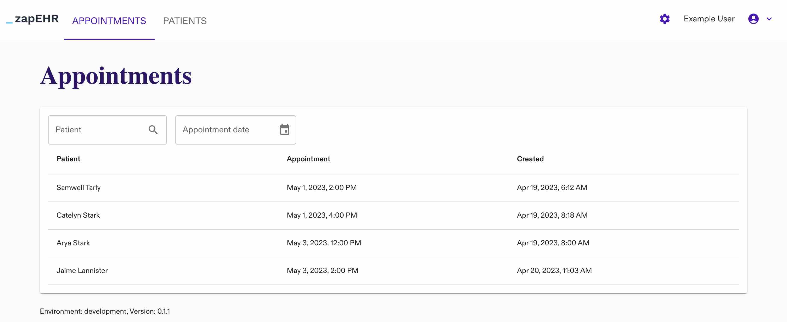
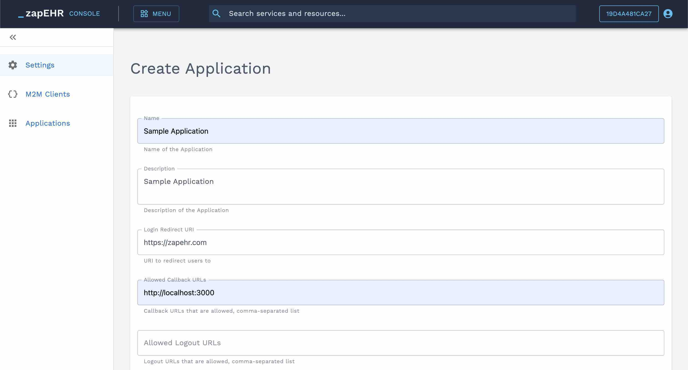

# zapEHR Sample EHR Application

## Introduction

This is a sample EHR application built using [zapEHR](https://zapehr.com), a platform for building health applications.

## Running Locally

Before you can run the app successfully locally, you need to configure a zapEHR Application to facilitate login.

### Configure zapEHR Application

Go to [console.zapehr.com](https://console.zapehr.com). If you don't have an account, please contact us for access at <info@zapehr.com> or on [zapehr.com](https://zapehr.com).

Then go to Menu -> Project Settings -> [Applications](https://console.zapehr.com/project/applications) and click "Create". Give the Application a name and description. For our sample application, we will be making an application for "Sample Application". Make the login redirect URI [https://zapehr.com](https://zapehr.com) and the allowed callback URLs [http://localhost:3000](http://localhost:3000), then click "Create". The login redirect URI is "https://zapehr.com" because we are running this locally and the login redirect URI cannot be localhost, but if you deploy an application you can change this to your application's URI.

Copy the Application's Client ID and replace `PUT_YOUR_ZAPEHR_CLIENT_ID_HERE` in [env/.env.local](env/.env.local).

### Start the Local Server

Requires: Node.js v18.

1. `npm install`
2. `npm run start`

The application will launch at [http://localhost:3000](http://localhost:3000).

In order to log in, you will need to create a User so you will have credentials.

### Create a User

You can [create Users using zapEHR's APIs](https://docs.zapehr.com/reference/post_user-invite).

### Log in

Go back to [http://localhost:3000](http://localhost:3000) and log in with the user's credentials.

### Explore

Now you can explore the application. To begin you won't have any data, but you can try [creating resources like Patients](https://console.zapehr.com/resources/Patient/new) on the zapEHR console.
